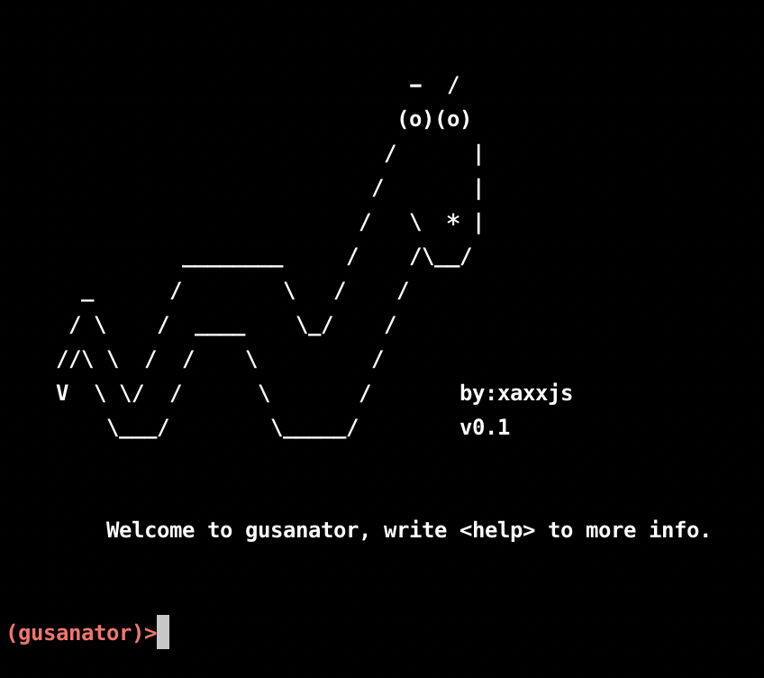
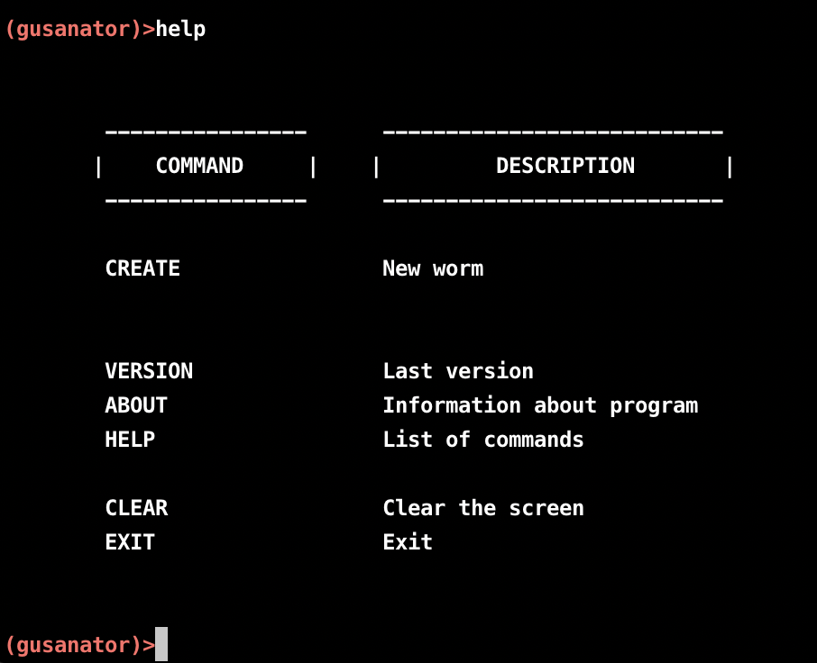
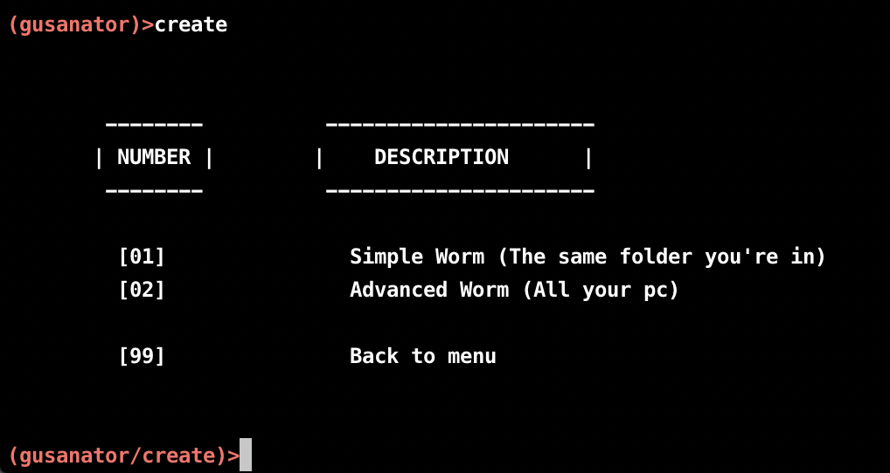
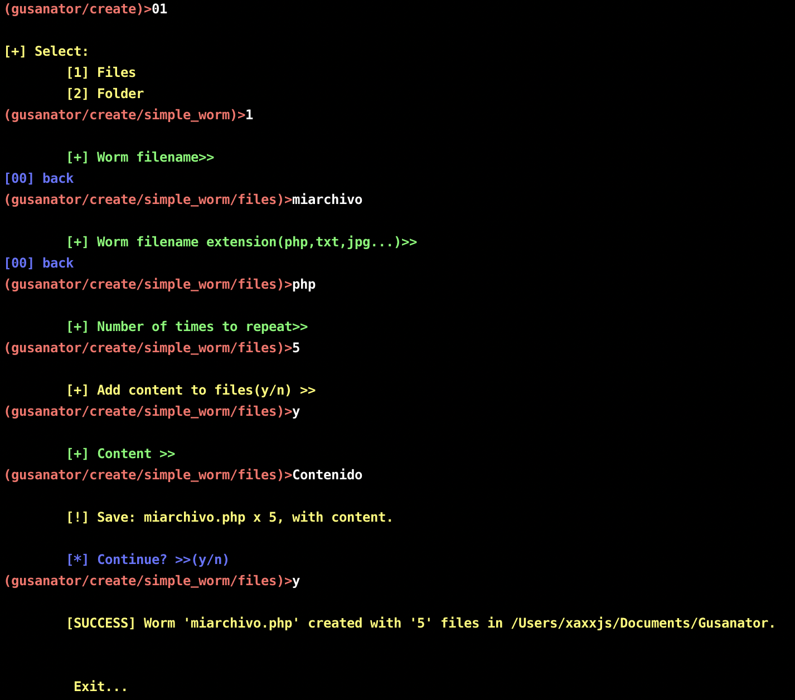
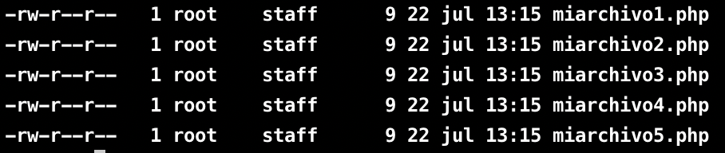
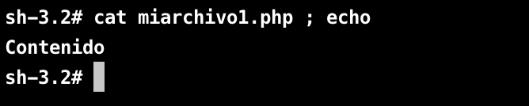
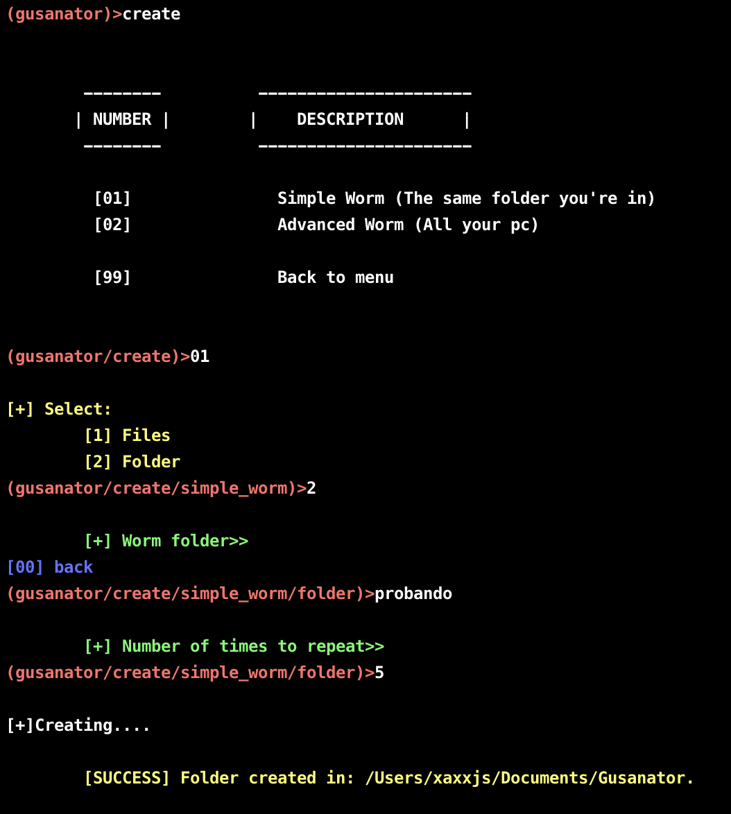
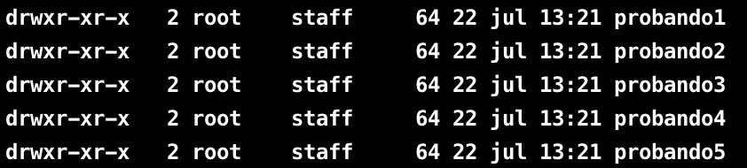
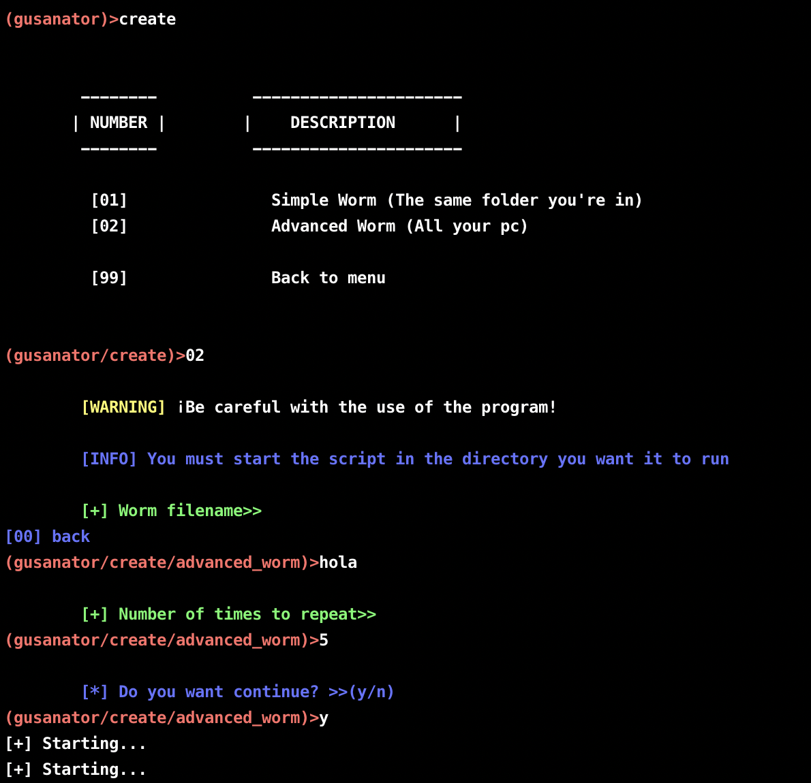

<b>GUSANATOR</b> se trata de un programa que emula a un "gusano informático" (malware), creación de múltiples directorios y/o archivos en la ruta que tu elijas.
Ademas, puedes añadirle la extensión que prefieras en los archivos y también puedes añadir textos dentro de cada uno de los archivos.

**¡¡ADVERTENCIA!!**

Debes tener mucho cuidado en como lo usas, y en que directorio lo estás ejecutando.

**RUN SCRIPT**

> python3 <b>gusanator.py</b>

Funcionamiento
=======

Una vez iniciado, escribimos <b>help</b> para ver la lista de comandos disponibles.

Voy a centrarme en el comando <b>CREATE</b>

Al ejecutarlo nos aparecerá algo asi:

PRIMERA OPCION
======

La primera opión es para ejecutar un sencillo gusano en el cual UNICAMENTE afectará a la ruta actual.

Puedes crear tanto <b>directorios</b> como <b>archivos</b>

**ARCHIVOS**

Escribes el nombre del archivo, a continuación pones la extensión que quieras, te pedriá el numero de veces que quieres que se ejecute,
y después te pedirá si quieres añadir contenido(es opcional) para que lo tengan todos los archivos que vayas a crear.

A continuación los pasos del archivo.

El resultado que nos da en la terminal, es el siguiente :

Y como le dijimos que queríamos contenido, nos puso contenido a todos los archivos.

**DIRECTORIOS**

Escribes el nombre del directorio, te pedirá el numero de veces que quieras que se ejecute en tu directorio actual.

SEGUNDA OPCION
======

La <b>segunda opción</b> es la más interesante de todas, depende de tu directorio actual te crea múltiples de carpetas en todas las carpetas que encuentre
y todo recursivamente.

<b>¡Gracias por leer, diviértete!</b>
